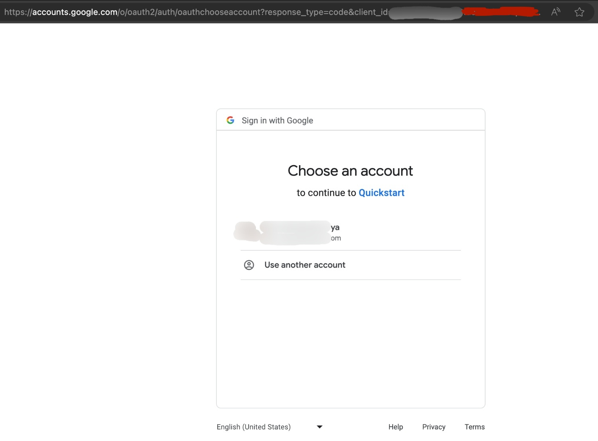
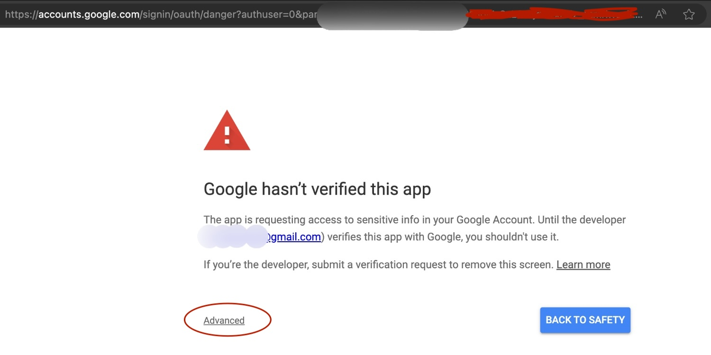
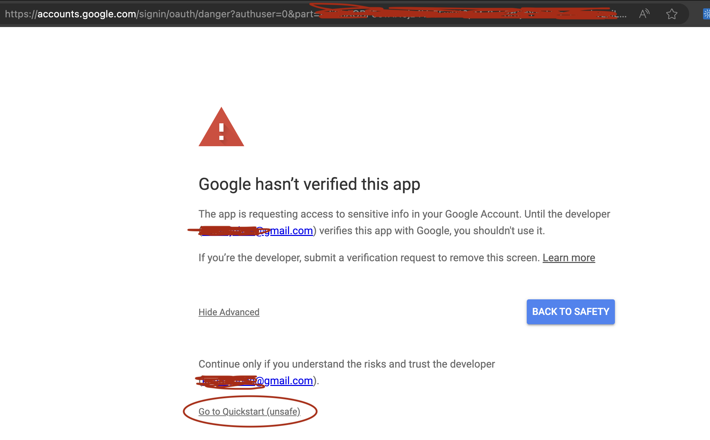
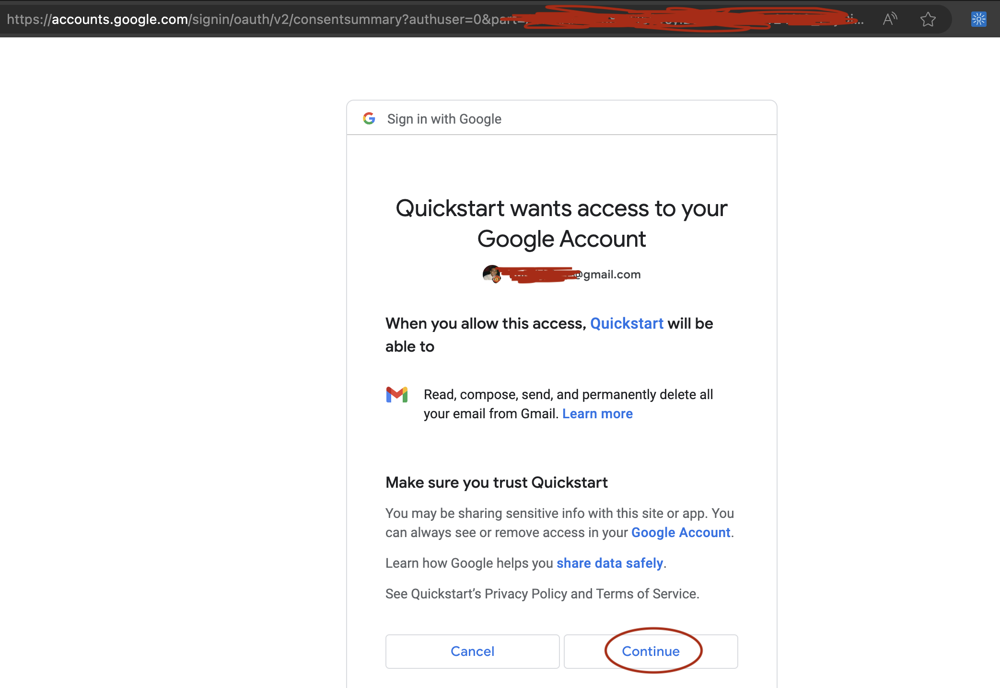
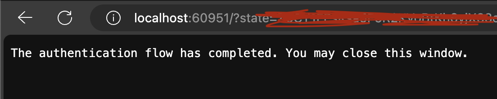
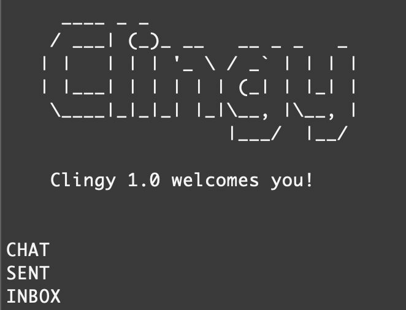
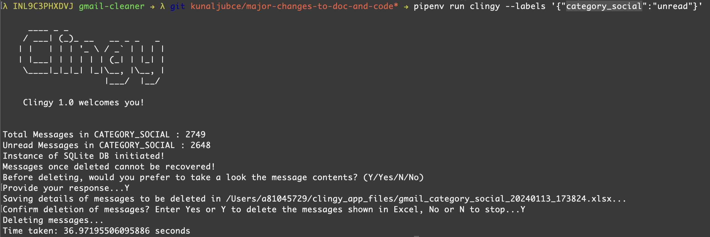

#### Are you tired of those thousands of social, promotional and spam mails flooding your inbox?
#### Now that Google Photos is a part of your 15 GB Google Drive capacity, are you freaked out about cleaning up your mail box?
#### Are you obsessed with sorting your mails into various labels, which become irrelevant over time?

## Introducing Clingy (pronounced, Cling-ee) - Your personal Gmail cleaner
### The Why! 
Clingy is a CLI (Command Line Interface) tool that will purge your mailbox of unnecessary emails such as spam, promotions, and social and let you take complete control of your Google drive space. Simultaneously, it will also keep a backup of all mails deleted, on your local harddisk in a light-weight SQLite database instance, just in case you ever wanted to check or retreive info about a previously deleted email. By keeping the email backups on your local, you are also guaranteed about not compromising the security and integrity of your mailbox as we don't store copies of your mails anywhere else.

### The What!
- You install Clingee on your laptop/desktop and setup a one-time authentication to your Gmail id.
- You let it run some checks and tell you which all labels are there on your mail box and how many mails (unread/total) are there in each of them.
- You choose the labels and the types of mails to delete from each of them. Bingo! Clingy does the rest and you have a perfectly clean mailbox.

### The How!
#### Prerequisites - 
* Clone this repo using the command - `git clone https://github.com/kunaljubce/gmail-cleaner.git`.
* Once clone process has finished, navigate inside the directory using the command - `cd gmail-cleaner`.
* Generate the `credentials.json` file. This is an API key file that provides the application with the credentials to request access to your gmail. You can find the steps to generate this file [here](https://developers.google.com/workspace/guides/create-credentials#api-key).
* Once created, please download the file and move it to the current directory and save it as `credentials.json`.
* Setup the environment using the command - `pipenv sync -d`. This will setup your virtual environment using Pipfile.Lock.

#### Test if your credentials.json is valid
* Execute the command - `pipenv run pytest`. 

If your authentication is working fine, the test will succeed and you should see the below message - 
```
→ pipenv run pytest                                                
======================================================================= test session starts =======================================================================
platform darwin -- Python 3.8.18, pytest-7.4.4, pluggy-1.3.0
rootdir: /Users/a81045729/Documents/constant_variables/gmail-cleaner
configfile: pytest.ini
collected 1 item                                                                                                                                                  

tests/test_auth.py .                                                                                                                                        [100%]

======================================================================== 1 passed in 0.94s ========================================================================
```

For first time users, you will be redirected to a Google screen to choose your Gmail account and authenticate the application as below. If you have used Clingy before, you should not have to follow the below steps and instead you will directly see the above success message on your console.

- Step 1: Choose the account on which you want Clingy to run its magic:

    

- Step 2: The next screen will show you a warning. Click on Advanced:

    

- Step 3: On the next screen, click on "Go to Quickstart (unsafe)" as highlighted in the screenshot below:

    

- Step 4: The next screen will prompt you to allow Quickstart access to your Google Account, press Continue:

    

- Step 5: If everything went as expected, you should see a success message like below.

    

#### Congratulations! Now you are ready to execute Clingy operations on your Gmail. 

* To fetch all labels from your mailbox:
`pipenv run clingy --fetch-labels True`

    

* To delete all *unread* mails from the label *category_promotions*:
`pipenv run clingy --labels '{"category_social":"unread"}'`

    

### More instrustions to follow...
